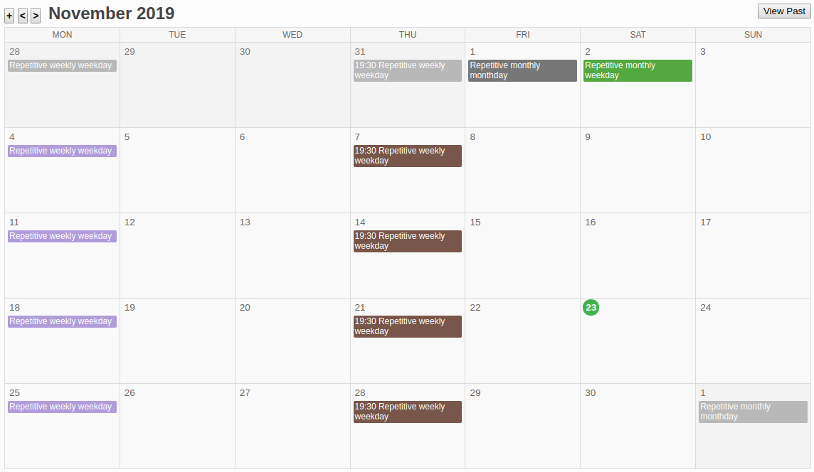
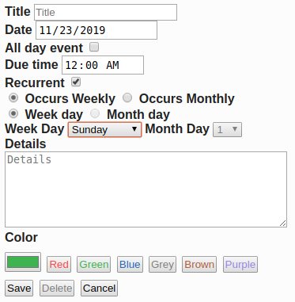

[](https://circleci.com/gh/Kartones/flask-calendar/tree/master)

# flask-calendar

## Introduction

At December 2017, I decided I wanted to opt out from Google services as much as possible. One of the services that tied me most was Calendar. There are not many alternatives, and even fewer web-based. I decided to try using a Trello board with due dates and some labels for a while, but proved to be harder to maintain. Add the lack of a month calendar view, and no support for recurrent/repetitive tasks, and I decided to do good use of a holidays to spend some hours and build a simple GCalendar clone.


### Details

Main calendar view:



Create new task view:



Supports a basic drag & drop on desktop of days (like Google Calendar), edition of existing tasks, creation of repetitive tasks (daily, montly, by weekday, by month day or on specific day number), custom colors, and a few options like hiding past tasks or being able to manually hide those repetitive task ocurrences (I like a "clean view" and usually remove/hide past tasks).

It is mobile friendly (buttons for actions are ugly and cannot drag & drop days on mobile, but otherwise works), might not be perfectly designed for all resolutions but at least works.


## Remarks

Compatible with Firefox, Brave and Chrome. No plans for other browser support (but PRs are welcome).

No Javascript libraries and no CSS frameworks used, so this means the corresponding code and styles are accordingly non-impressive.

No databases, as I don't need to do any querying or complex stuff I couldn't also do with JSON files and basic dictionaries.

Authentication works using werkzeug SimpleCache for storage, which means if the application runs with more than one thread you'll get into problems. Run it with a single process uwsgi or similar.

HTML inputs are favoring HTML5 ones instead of fancy jquery-like plugins to reduce support and increase mobile compatibility.


## Requirements

- Python 3.5+ (type hints are compatible with 3.5 upwards)

Other requirements are on the `requirements.txt` file. Install them with `pip` or similar.

## Data Migrations

Starting with version `v1.0`, there is a `\scripts` folder that will contain any required migrations. They will be listed here in this section to simplify things.

### Migrations

- `data_migration_001`: **`v0.9` -> `v1.0`**. Not backwards compatible once migrated. Must be run before `v1.0` logic or server will throw errors and maybe could override old `due_time` fields.

## Docker Environment

- Development strongly encourages using Docker and Docker Compose.

### Running

- Edit `config.py` and fill in or adapt to your needs.

```bash
make run
```

Sample username is `a_username` with password `a_password`.

### Locale

`dev` Dockerfile installs a sample locale (`es_ES`), but does not activate it. Refer to that file and to the `config.py` file for setting up any locale or commenting the lines that install them to speed up container bootup if you're sure don't want them.

Remember you can check which locales you have installed with `locale -a` and add new ones with the following commands:
```bash
cd /usr/share/locales
sudo ./install-language-pack es_ES
sudo dpkg-reconfigure locales
```


### Testing

- Run tests:
```bash
make test
```

- Extract code coverage:
```bash
make coverage
```

### Contributing / Pull Requests

Please ensure you've setup pre-commit (it's [installed](https://pre-commit.com/#installation), then run `pre-commit install` on the repository) so that flake8 and other linters run before pushing the code.
This project uses [black](https://github.com/psf/black) and [isort](https://github.com/timothycrosley/isort) so it might auto-format your files and modify them. Just check them and add to the commit (should only be text formatting and import ordering related).

## Virtualenv Environment

1. Create the virtual environment:
```bash
$ python3 -m venv .venv
```

2. Activate it:
```bash
$ source .venv/bin/activate
```

3. Install dependencies (in the virtual environment):
```bash
(.venv) $ pip install -r requirements.txt
(.venv) $ pip install -r requirements-dev.txt
```

4. You are now ready to run the test, extract coverage or run a testing server:
```bash
(.venv) $ # Run tests
(.venv) $ pytest

(.venv) $ # Extract coverage into './cov_html' folder
(.venv) $ pytest --cov-report html:cov_html  --cov=. --cov-config .coveragerc

(.venv) $ # Run testing server
(.venv) $ python -m flask_calendar.app
```

## Miscellaneous

### User creation/deletion

As there is no admin interface, to create or delete users you should create a python file with code similar to the following example:

```python
from authentication import Authentication
import config


authentication = Authentication(data_folder=config.USERS_DATA_FOLDER, password_salt=config.PASSWORD_SALT)

# Create a user
authentication.add_user(
    username="a username",
    plaintext_password="a plain password",
    default_calendar="a default calendar id"
)

# Delete a user
authentication.delete_user(username="a username")
```
