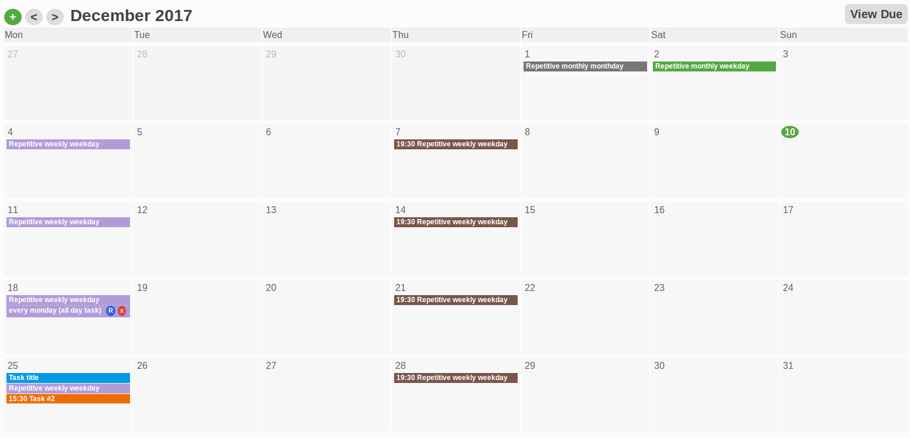
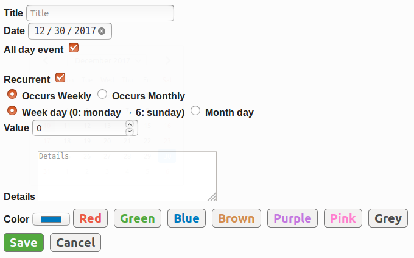

# flask-calendar

## Introduction

I recently (dec 2017) decided I wanted to opt out from Google services as much as possible. One of the services that tied me most was Calendar. There are not many alternatives, and even fewer web-based. I decided to try using a Trello board with due dates and some labels for a while, but proved to be harder to maintain. Add the lack of a month calendar view, and no support for recurrent/repetitive tasks, and I decided to do good use of a holidays to spend some hours and build a simple GCalendar clone.


### Details

Main calendar view:



Create new task view:



Built with Firefox, intended to work also on Chrome and Brave, should work also on other recent browsers, but I won't ever add support for Internet Explorer.

No Javascript libraries, no CSS frameworks. Of course the corresponding code and styles are accordingly non-impressive, but for such a small project didn't wanted to start adding Bootstraps/Foundations or JQuerys or similar.

No databases, as I don't need to do any querying or complex stuff I couldn't also do with JSON files and basic dictionaries.

Also intended to be a tiny Flask app so minimal coding and functionality used. I didn't wanted to use AJAX at first but quickly came up to the realization that some paths were actually faster so in the end has a few JS lines.

No tests built as main challenge has been my lack of CSS skills and rusty, outdated Javascript. Controllers are also a bit more fat than I'd like but I was just hacking away logic as required without much pre-planning.


Overall, lessons learned:

- Next project will be Django. What I win in speed building the routing and views, I lose then building validations.
- I suck at CSS so I'll stick to Bootstrap/Foundation. This time what I did works but I've spent more time fighting with CSS than building code.
- I'll give a try next time to turbolinks, to trully try to avoid javascript for tiny projects.

### Changelog

List of new features added to the original project commits

- 2018-xx-xx: Bring back action buttons for small (phone) screens. Improved (less terrible) favicon and colors
- 2017-12-22: "Hide" button to remove individual instances of repetitive/recurrent tasks
- 2017-12-21: Cleanup of internal data files when a day/month becomes empty of tasks
- 2017-12-20: Basic drag & drop (to change day inside same month of a non-recurring task). Intended only for desktop, probably rough on the edges but working.
- 2017-12-30: Event edition. Mobile drag & drop disabled. Mobile CSS improvements.

## Requirements

- Python 3.5+ (type hints are compatible with 3.5 upwards)

Other requirements are on the `requirements.txt` file.

## Running

- copy `config.py.sample` to `config.py` and fill in.

```
python3 app.py
```

## Testing

- Install requirements from `requirements-dev.txt` file.

```
pytest
```


## TODOs / Roadmap

This are initially the only features I plan to build:

- TESTS! No more new features without tests
- coverage.py
- circleci (grab xml config from mazes for programmers prj)
- set locale to one setup in config
- reconvert `<br>` to `\n` upon edit description
- cleanup of past "hidden_repetition" tasks when current date's month > stored month (delete full month)
- min and max dates for input type date: min="xxxx-xx-xx" max="xxxx-xx-xx"
- error messages
- a decent weekday and month day choosers when recurrency is selected
- Yearly repetition? (would need month and day)
- Users (should be able to access calendars), authentication and authorization
- Multi-day tasks?
